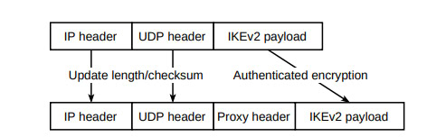
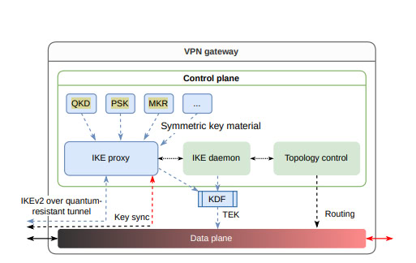
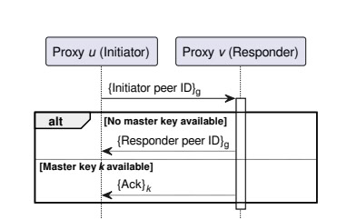
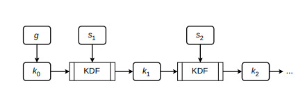
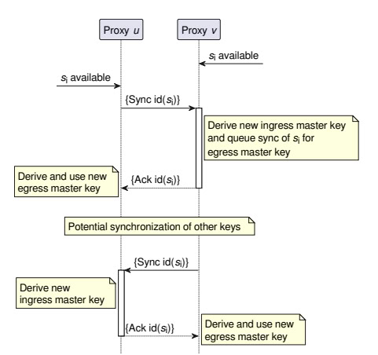

# شبکه‌های خصوصی مجازی در عصر کوانتوم: رویکرد امنیت در عمق

رمزنگاری نامتقارن متداول توسط توسعه مداوم کامپیوترهای کوانتومی تهدید می‌شود. یک اقدام اجباری در زمینه شبکه‌های خصوصی مجازی (VPNها) استفاده از رمزنگاری پساکوانتومی (PQC) به عنوان جایگزینی برای تبادل کلید احراز هویت شده در پروتکل تبادل کلید اینترنت (IKE) است.

## نتیجه‌گیری

توسعه کامپیوترهای کوانتومی روش‌های رمزنگاری فعلی VPNها را تهدید می‌کند. رمزنگاری پساکوانتومی (PQC) یک اقدام اجباری است، اما همچنان تحت بررسی است. مقاله پیشنهاد می‌دهد ترکیب PQC با توزیع کلید کوانتومی (QKD) و تقویت کلید چند مسیری (MKR) برای امنیت بیشتر. راه‌حل پیشنهادی شامل یک پروکسی سبک برای بسته‌های IKE است که از همه کلیدهای متقارن موجود برای ایجاد تونل رمزنگاری استفاده می‌کند. این اطمینان حاصل می‌کند که حتی اگر PQC نقض شود، VPN همچنان امن باقی می‌ماند.

## نکات کلیدی

- **تهدید کوانتومی**: کامپیوترهای کوانتومی تهدید قابل توجهی برای رمزنگاری نامتقارن فعلی مورد استفاده در VPNها هستند.
- **اهمیت PQC**: رمزنگاری پساکوانتومی ضروری است تا الگوریتم‌های کلاسیک مانند RSA و ECDSA را جایگزین کند.
- **روش‌های عمود**: ترکیب PQC با QKD و MKR دفاع قوی‌تری در برابر حملات کوانتومی ارائه می‌دهد.
- **پروکسی سبک**: یک پروکسی سبک می‌تواند بسته‌های IKE را به طور شفاف تونل‌سازی کند و از کلیدهای متقارن ترکیبی استفاده کند.
- **امنیت در عمق**: رویکرد پروکسی امنیت در عمق را تضمین می‌کند و ترافیک VPN را حتی در صورت نقض PQC محافظت می‌کند.
- **احراز هویت موجودیت**: شناسایی امن دروازه‌های VPN برای VPNهای مقاوم در برابر کوانتوم ضروری است.
- **محرمانگی**: محرمانگی ترافیک مشتری باید به صورت انتها به انتها تضمین شود، حتی با دروازه‌های واسط.
- **یکپارچگی داده‌ها**: محافظت از یکپارچگی داده‌ها و جلوگیری از حملات بازپخش برای ارتباطات امن VPN حیاتی است.
- **همگام‌سازی کلید**: یک پروتکل برای همگام‌سازی کلیدهای متقارن بین پروکسی‌ها لازم است تا امنیت مداوم حفظ شود.
- **ذخیره‌سازی کلید ماندگار**: ذخیره‌سازی امن کلیدهای متقارن و روش‌های بازیابی برای حفظ امنیت VPN ضروری است.

## خلاصه

1. **تهدید کوانتومی**: کامپیوترهای کوانتومی روش‌های رمزنگاری فعلی VPNها را تهدید می‌کنند و نیاز به روش‌های جدید برای اطمینان از امنیت وجود دارد.
2. **رمزنگاری پساکوانتومی (PQC)**: اجرای PQC برای جایگزینی الگوریتم‌های کلاسیک آسیب‌پذیر در VPNها اجباری است.
3. **ترکیب روش‌های امنیتی**: استفاده از PQC به همراه QKD و MKR دفاع قوی‌تری در برابر حملات کوانتومی ارائه می‌دهد.
4. **مفهوم پروکسی سبک**: یک پروکسی سبک پیشنهاد می‌شود که می‌تواند بسته‌های IKE را با استفاده از همه کلیدهای متقارن موجود تونل‌سازی کند و امنیت را افزایش دهد.
5. **امنیت در عمق**: این روش پروکسی امنیت لایه‌ای ارائه می‌دهد و نفوذ به ترافیک VPN را برای حمله‌کنندگان دشوار می‌کند.
6. **احراز هویت موجودیت**: اطمینان از شناسایی امن دروازه‌های VPN برای حفظ VPNهای مقاوم در برابر کوانتوم حیاتی است.
7. **محرمانگی انتها به انتها**: VPNها باید محرمانگی ترافیک مشتری را در طول مسیر ارتباطی تضمین کنند.
8. **محافظت از یکپارچگی و بازپخش**: شناسایی تغییرات غیرمجاز داده‌ها و جلوگیری از حملات بازپخش برای عملیات امن VPN ضروری است.
9. **پروتکل همگام‌سازی کلید**: همگام‌سازی کلیدهای متقارن بین پروکسی‌های VPN برای حفظ امنیت مداوم لازم است.
10. **ذخیره‌سازی کلید ماندگار**: ذخیره‌سازی امن کلیدهای متقارن و داشتن روش‌های بازیابی قابل اعتماد برای امنیت VPN حیاتی است.

## مقدمه

رمزنگاری نامتقارن به عنوان یک جزء اساسی از شبکه‌های خصوصی مجازی مدرن (VPNها) عمل می‌کند. با این حال، الگوریتم‌های رمزنگاری فعلی با تهدیدات قابل توجهی از سوی حمله‌کنندگان مجهز به کامپیوترهای کوانتومی قدرتمند مواجه هستند که در این مقاله به عنوان حمله‌کنندگان کوانتومی معرفی می‌شوند.

#### تهدید کوانتومی برای رمزنگاری نامتقارن

کامپیوترهای کوانتومی پتانسیل شکستن الگوریتم‌های کلاسیک مانند RSA و ECDSA را دارند که به طور گسترده‌ای در VPNها برای ارتباطات امن استفاده می‌شوند. [**الگوریتم شور**](https://en.wikipedia.org/wiki/Shor%27s_algorithm)، یک الگوریتم کوانتومی شناخته شده، می‌تواند مسائل را به طور کارآمد حل کند که امنیت این روش‌های رمزنگاری کلاسیک را تامین می‌کنند، آن‌ها را در برابر حملات کوانتومی آسیب‌پذیر می‌کند.

#### رمزنگاری پساکوانتومی (PQC)

آژانس‌های امنیتی در سراسر جهان توصیه می‌کنند که رمزنگاری پساکوانتومی (PQC) به عنوان یک اقدام اجباری برای مقابله با تهدیدات کوانتومی اتخاذ شود. الگوریتم‌های PQC برای مقاومت در برابر حملات کوانتومی طراحی شده‌اند و می‌توانند به عنوان جایگزین‌های فوری برای الگوریتم‌های کلاسیک در پروتکل تبادل کلید اینترنت (IKE) استفاده شوند، به ویژه IKEv2 که برای احراز هویت موجودیت و تبادل کلید در VPNها استفاده می‌شود.

#### چالش‌های PQC

با وجود وعده‌های آن، حوزه PQC نسبتا جوان است و اعتماد به پیاده‌سازی‌های PQC هنوز به اندازه الگوریتم‌های کلاسیک در دوره پیش از کوانتوم نیست. تلاش‌های رمزنگاری اخیر نقایصی را در برخی از الگوریتم‌های PQC، از جمله فینالیست‌های سابق در فرآیند استانداردسازی موسسه ملی استاندارد و فناوری (NIST)، کشف کرده‌اند.

#### روش‌های عمود برای تبادل کلید مقاوم در برابر کوانتوم

با توجه به عدم قطعیت‌های موجود در مورد PQC، این مقاله روش‌های اضافی برای امن‌سازی VPNها در برابر حمله‌کنندگان کوانتومی را بررسی می‌کند. این روش‌ها شامل:

- **توزیع کلید کوانتومی (QKD)**: از اصول مکانیک کوانتوم برای ایجاد کلیدهای امن بین طرفین استفاده می‌کند.
- **تقویت کلید چند مسیری (MKR)**: امنیت را با توزیع سهم‌های کلید در مسیرهای مختلف شبکه افزایش می‌دهد.

#### رویکرد ترکیبی برای حداکثر امنیت

هر یک از این روش‌ها در صورت استفاده به تنهایی محدودیت‌هایی دارند. بنابراین، مقاله از یک رویکرد ترکیبی که از همه منابع موجود کلید متقارن برای محافظت از ترافیک درون یک VPN استفاده می‌کند، حمایت می‌کند. 
> راه‌حل پیشنهادی شامل یک پروکسی سبک است که بسته‌های IKE را به طور شفاف تونل‌سازی می‌کند و آن‌ها را با ترکیبی از کلیدهای متقارن، مانند کلیدهای QKD و MKR، علاوه بر PQC، امن می‌کند.

#### امنیت در عمق

با ترکیب روش‌های مختلف تبادل کلید مقاوم در برابر کوانتوم، رویکرد پیشنهادی هدف ارائه امنیت در عمق را دارد. این بدان معناست که حتی اگر یک روش نقض شود، امنیت کلی VPN به دلیل لایه‌های اضافی حفاظت دست نخورده باقی می‌ماند.

---

## نکات کلیدی

- **رمزنگاری نامتقارن**: اساسی برای VPNهای مدرن اما توسط کامپیوترهای کوانتومی تهدید می‌شود.
  

-**تهدید کوانتومی**: حمله‌کنندگان کوانتومی می‌توانند الگوریتم‌های کلاسیک مانند RSA و ECDSA را با استفاده از الگوریتم‌های کوانتومی مانند الگوریتم شور شکستن کنند.

3. **رمزنگاری پساکوانتومی (PQC)**: توسط آژانس‌های امنیتی به عنوان یک اقدام مقابله‌ای توصیه می‌شود، اما همچنان نسبت به الگوریتم‌های کلاسیک کمتر اعتمادپذیر و کارآمد است.

4. **توزیع کلید کوانتومی (QKD)**: از مکانیک کوانتومی برای

 ایجاد کلیدهای امن بین طرفین استفاده می‌کند.

- **تقویت کلید چند مسیری (MKR)**: سهم‌های کلید را در مسیرهای مختلف شبکه توزیع می‌کند تا امنیت را افزایش دهد.

- **رویکرد ترکیبی**: از همه منابع موجود کلید متقارن (QKD، MKR، PQC) برای محافظت از ترافیک VPN استفاده می‌کند.

- **پروکسی سبک**: راه‌حل پیشنهادی شامل یک پروکسی است که بسته‌های IKE را تونل‌سازی می‌کند و از ترکیبی از کلیدهای متقارن برای افزایش امنیت استفاده می‌کند.

- **امنیت در عمق**: تضمین می‌کند که حتی اگر یک روش امنیتی نقض شود، امنیت کلی VPN قوی باقی می‌ماند.
## پس زمینه: شبکه‌های خصوصی مجازی

این بخش یک مرور کلی از پیاده‌سازی‌های VPN سایت به سایت و اصول زیرین آنها ارائه می‌دهد، با تمرکز بر استفاده از IPsec برای ارتباطات امن در شبکه‌های عمومی غیرمطمئن.

#### پیاده‌سازی VPN سایت به سایت

در یک پیاده‌سازی VPN سایت به سایت، دروازه‌های VPN چندین شبکه خصوصی مطمئن را از طریق تونل‌های امن بر روی یک شبکه عمومی غیرمطمئن متصل می‌کنند. هر سایت، مانند یک دفتر شرکت یا یک نهاد عمومی، یک دروازه VPN دارد که ترافیک را از مشتریان داخل شبکه خصوصی محلی به سایت‌های دوردست به صورت امن تونل‌سازی می‌کند.

*شکل 1: مثال برای یک پیاده‌سازی VPN سایت به سایت: دروازه‌های VPN چندین شبکه خصوصی (مطمئن) را از طریق یک شبکه عمومی غیرمطمئن با برقراری تونل‌های امن متصل می‌کنند.*

#### خانواده پروتکل IPsec

VPN در لایه شبکه با استفاده از خانواده پروتکل IPsec عمل می‌کند، که شامل نسخه دوم پروتکل تبادل کلید اینترنت (IKEv2) برای احراز هویت موجودیت و تبادل کلید است. IKEv2 مسئول برقراری انجمن‌های امنیتی (SA) است که توسط محموله امنیتی کپسول‌گذاری (ESP) برای اطمینان از محرمانگی و یکپارچگی داده‌ها در این تونل‌ها استفاده می‌شود.

#### انجمن‌های امنیتی (SA)

SAهای برقرار شده یک توپولوژی پوششی ایجاد می‌کنند که به صورت پویا مسیریابی بهینه و مقیاس‌پذیری VPN را تعیین می‌کند. این توپولوژی پوششی می‌تواند سناریوهای پیچیده‌ای مانند دروازه‌های VPN لانه‌ای یا متعادل‌کننده بار را مدیریت کند. بسته‌ها باید همچنان از انتها به انتها محافظت شوند، حتی زمانی که برخی دروازه‌ها نمی‌توانند به صورت مستقیم به یکدیگر برسند به دلیل فایروال‌های خارجی یا سناریوهای لانه‌ای.

#### کنترل توپولوژی پوششی و مسیریابی

برای پیاده‌سازی VPNهای بسیار مقیاس‌پذیر و قوی، الگوریتم کنترل توپولوژی به صورت پویا توپولوژی پوششی را تعیین می‌کند. این الگوریتم مسیریابی درون پوششی را مدیریت می‌کند، اطمینان از محافظت انتها به انتها با پیاده‌سازی SAهای لانه‌ای در صورت لزوم. معماری یک دروازه VPN شامل یک صفحه کنترل برای کنترل توپولوژی و یک صفحه داده برای مسیریابی بسته‌های مشتری است، همانطور که در شکل 2 نشان داده شده است.

*شکل 2: معماری پایه یک دروازه VPN: یک الگوریتم کنترل توپولوژی تصمیم می‌گیرد که کدام SAها باید برقرار شوند و مسیریابی پوششی را مدیریت می‌کند. دیمن IKE مسئول برقراری SAها با استفاده از تبادل کلید احراز هویت شده است. صفحه داده از TEK مشتق شده برای محافظت از بسته‌های مشتری با استفاده از ESP استفاده می‌کند و آن‌ها را براساس تصمیم مسیریابی ارسال می‌کند. خطوط نقطه‌چین جریان کنترل را نشان می‌دهند، خطوط پیوسته رابط‌های فیزیکی را نشان می‌دهند.*

#### نتیجه‌گیری

بخش پس زمینه بر اهمیت یک توپولوژی پوششی پویا و امن برای مقیاس‌پذیری و قوی بودن VPNها تأکید می‌کند. نقش‌های IKEv2 برای احراز هویت موجودیت و تبادل کلید و ESP برای اطمینان از محرمانگی و یکپارچگی داده‌ها را برجسته می‌کند. این بنیاد، زمینه را برای بحث در مورد بهبودهای امنیتی لازم برای حفاظت از VPNها در برابر تهدیدات کوانتومی فراهم می‌کند.

---

### نکات کلیدی

- **پیاده‌سازی VPN سایت به سایت**: چندین شبکه خصوصی مطمئن را از طریق تونل‌های امن بر روی یک شبکه عمومی غیرمطمئن متصل می‌کند.
- **خانواده پروتکل IPsec**: از IKEv2 برای احراز هویت موجودیت و تبادل کلید و از ESP برای محرمانگی و یکپارچگی داده‌ها استفاده می‌کند.
- **انجمن‌های امنیتی (SA)**: یک توپولوژی پوششی را ایجاد می‌کند که از مسیریابی پویا و مقیاس‌پذیری پشتیبانی می‌کند و داده‌ها را حتی در سناریوهای پیچیده از انتها به انتها محافظت می‌کند.
- **کنترل توپولوژی پوششی**: یک الگوریتم کنترل توپولوژی به صورت پویا مسیریابی بهینه و مقیاس‌پذیری VPN را تعیین می‌کند.
- **SAهای لانه‌ای**: محافظت انتها به انتها را با پیاده‌سازی SAهای لانه‌ای در صورت لزوم تضمین می‌کند.
- **معماری دروازه VPN**: شامل یک صفحه کنترل برای کنترل توپولوژی و یک صفحه داده برای مسیریابی بسته‌های مشتری است.
- **مقیاس‌پذیری و قوی بودن**: بر اهمیت یک توپولوژی پوششی پویا و امن برای مقیاس‌پذیری و قوی بودن VPNها تأکید می‌کند.
## اهداف و مدل تهدید

این بخش اهداف برای یک VPN مقاوم در برابر کوانتوم را تعریف کرده و مدل تهدید فرضی را با توجه به قابلیت‌های حمله‌کنندگان کوانتومی تشریح می‌کند.

#### اهداف

یک VPN مقاوم در برابر کوانتوم دارای اهداف زیر است که نسبت به VPNهای متداول بهبود یافته‌اند:

1. **احراز هویت موجودیت**: دروازه‌ها باید به صورت امن یکدیگر را شناسایی کنند و محدوده‌های آدرس IP خصوصی باید به صورت امن به دروازه‌ها پیوند داده شوند.
2. **محرمانگی**: محرمانگی ترافیک مشتری باید تضمین شود. این شامل محافظت رمزنگاری شده انتها به انتها از ترافیکی است که از طریق دروازه‌های واسط مسیر می‌یابد و اطمینان از رازداری پیشرفته، به طوری که نفوذ به کلیدهای بلندمدت تاثیری بر محرمانگی انجمن‌های امنیتی (SA) گذشته نداشته باشد.
3. **یکپارچگی داده‌ها و محافظت از بازپخش**: تغییرات غیرمجاز و بازپخش بسته‌های داده باید شناسایی و جلوگیری شود.
4. **چابکی رمزنگاری**: مکانیزم‌های رمزنگاری باید به راحتی قابل تعویض باشند تا با توسعه‌های جدید در رمزنگاری سازگار شوند.
5. **ویژگی‌های غیرعملکردی**: اجرای مقاومت در برابر کوانتوم نباید مقیاس‌پذیری، مقاومت در برابر حملات انکار سرویس (DoS)، کاهش تدریجی در صورت نفوذ به دستگاه‌ها و امنیت پیاده‌سازی را کاهش دهد.

#### مدل تهدید

مدل تهدید فرض می‌کند که یک حمله‌کننده Dolev-Yao بسیار قوی با دسترسی به یک کامپیوتر کوانتومی بزرگ است:

- **قابلیت‌های حمله‌کننده خارجی**: حمله‌کننده می‌تواند رمزنگاری نامتقارن کلاسیک را در لینک‌های کنترل شده بشکند، ترافیک را اکنون ذخیره کند و بعداً آن را پس از یافتن نقایصی در الگوریتم‌های PQC رمزگشایی کند و ممکن است تعداد محدودی از دروازه‌های VPN یا نهادهای امنیتی دیگر مانند دستگاه‌های QKD را نفوذ کند.
- **فرضیات در مورد محدودیت‌های حمله‌کننده**: قدرت محاسباتی و قابلیت‌های شنود حمله‌کننده محدود است، که مانع از شکستن رمزنگاری متقارن با اندازه کلید مناسب (≥ 256 بیت) یا شنود بر تمام لینک‌ها در همه زمان‌ها می‌شود.

مدل تهدید احتمال ذخیره‌سازی ترافیک توسط حمله‌کننده برای تلاش‌های رمزگشایی آینده را در نظر می‌گیرد و نیاز به حفاظت در برابر چنین تهدیدات بلندمدت را با اطمینان از رازداری پیشرفته و چابکی رمزنگاری برجسته می‌کند.

---

### نکات کلیدی

- **احراز هویت موجودیت**: دروازه‌ها باید به صورت امن یکدیگر را شناسایی کنند و محدوده‌های آدرس IP خصوصی را به دروازه‌ها پیوند دهند.
- **محرمانگی**: اطمینان از محافظت انتها به انتها از ترافیک مشتری و حفظ رازداری پیشرفته.
- **یکپارچگی داده‌ها و محافظت از بازپخش**: شناسایی و جلوگیری از تغییرات غیرمجاز و بازپخش بسته‌های داده.
- **چابکی رمزنگاری**: امکان تعویض مکانیزم‌های رمزنگاری به راحتی برای سازگاری با تهدیدات جدید.
- **ویژگی‌های غیرعملکردی**: حفظ مقیاس‌پذیری، مقاومت در برابر حملات DoS، کاهش تدریجی، و امنیت پیاده‌سازی در حین معرفی مقاومت در برابر کوانتوم.
- **مدل حمله‌کننده Dolev-Yao**: فرض یک حمله‌کننده قوی

 با قابلیت‌های محاسباتی کوانتومی، قادر به شکستن رمزنگاری کلاسیک و ذخیره‌سازی ترافیک برای رمزگشایی آینده.
- **محدودیت‌های حمله‌کننده**: توانایی حمله‌کننده برای شکستن رمزنگاری متقارن و شنود بر تمام لینک‌ها محدود به قدرت محاسباتی و منابع است.
- **حفاظت در برابر تهدیدات بلندمدت**: تأکید بر اهمیت رازداری پیشرفته و چابکی رمزنگاری برای محافظت در برابر تلاش‌های رمزگشایی آینده.
## تحقیقات گذشته

این بخش به فرآیند دو مرحله‌ای پیاده‌سازی خدمات امنیتی (احراز هویت موجودیت، محرمانگی، و یکپارچگی داده‌ها) در VPNها با استفاده از IPsec می‌پردازد، با تمرکز بر تبادل کلید احراز هویت شده و رمزنگاری احراز هویت شده. سپس، به بررسی روش‌های مختلف برای دستیابی به VPNهای مقاوم در برابر کوانتوم می‌پردازد، از جمله رمزنگاری پساکوانتومی (PQC) و روش‌های مدیریت کلید متقارن.

#### تبادل کلید احراز هویت شده و رمزنگاری احراز هویت شده

1. **تبادل کلید احراز هویت شده**: برقراری یک انجمن امنیتی جدید (SA) بین دو دروازه VPN شامل احراز هویت متقابل و اشتقاق یک کلید رمزنگاری ترافیک متقارن (TEK) جدید است.
2. **رمزنگاری احراز هویت شده**: با استفاده از TEK مشتق شده، دروازه‌ها تمام بسته‌های مشتری را رمزگذاری کرده و تگ‌های احراز هویت را برای محافظت از یکپارچگی آن‌ها اضافه می‌کنند.

از آنجایی که رمزنگاری متقارن با کلیدهای به اندازه کافی بزرگ (≥ 256 بیت) در دوره کوانتوم همچنان امن باقی می‌ماند، تنها تبادل کلید احراز هویت شده نیاز به تطبیق برای اطمینان از مقاومت در برابر کوانتوم دارد. این می‌تواند با استفاده از PQC یا رمزنگاری متقارن انجام شود.

#### رمزنگاری پساکوانتومی (PQC)

الگوریتم‌های PQC می‌توانند به عنوان جایگزین‌های فوری برای روش‌های رمزنگاری نامتقارن کلاسیک مانند RSA، ECDSA، و تبادل کلید دیفی-هلمن خدمت کنند. چندین الگوریتم PQC توسط NIST استانداردسازی می‌شوند، از جمله سه طرح امضا و یک مکانیزم رمزگذاری کلید (KEM).

با این حال، PQC معایبی دارد:

- **کارایی**: الگوریتم‌های PQC عموماً کمتر کارآمد هستند نسبت به رمزنگاری منحنی بیضوی کلاسیک، که منجر به سربار محاسباتی بیشتر و اندازه‌های کلید و امضای بزرگتر می‌شود.
- **بلوغ**: رمزنگاری الگوریتم‌های PQC به اندازه الگوریتم‌های کلاسیک بالغ نیست، همانطور که کشف‌های اخیر نقص‌ها در فینالیست‌های سابق NIST نشان می‌دهد.

به همین دلیل، حالت‌های ترکیبی که الگوریتم‌های کلاسیک و PQC را ترکیب می‌کنند برای تبادل کلید احراز هویت شده توصیه می‌شود.

#### مدیریت کلید متقارن

یک رویکرد جایگزین برای دستیابی به مقاومت در برابر کوانتوم شامل استفاده از روش‌های مدیریت کلید متقارن مانند کلیدهای پیش‌اشتراکی (PSKها)، توزیع کلید کوانتومی (QKD)، و تقویت کلید چند مسیری (MKR) است.

1. **کلیدهای پیش‌اشتراکی (PSKها)**: PSKهای جفتی بین دروازه‌ها می‌توانند استفاده شوند، اما مدیریت و به‌روزرسانی PSKها دشوار است. کلیدهای گروهی ثابت راحت هستند اما اگر هر دروازه‌ای نفوذ کند ناامن می‌شوند.
2. **توزیع کلید کوانتومی (QKD)**: QKD از کیوبیت‌ها برای تبادل کلید استفاده می‌کند، که امنیت را بر اساس اصول مکانیک کوانتومی فراهم می‌کند. با این حال، QKD به دلیل نیاز به اتصالات نوری مستقیم و هزینه‌های عملیاتی بالا محدود است. نودهای مطمئن می‌توانند کلیدهای QKD را در فواصل طولانی منتقل کنند اما امنیت انتها به انتها را فراهم نمی‌کنند.
3. **تقویت کلید چند مسیری (MKR)**: MKR کلیدها را به سهم‌ها تقسیم کرده و آن‌ها را در مسیرهای مختلف منتقل می‌کند، که امنیت را در صورتی افزایش می‌دهد که حمله‌کنندگان نتوانند همه مسیرها را شنود کنند. MKR می‌تواند با QKD برای امنیت بیشتر ترکیب شود.

#### استفاده از PSKها در IPsec

کلیدهای تبادلی خارجی، مانند کلیدهای مشتق شده از QKD و MKR، می‌توانند به عنوان PSK در IKE در نظر گرفته شوند. توسعه‌های IKEv2 اجازه می‌دهد که PSKها در TEKها گنجانده شوند، که بسته‌های IKE را محافظت کرده و نشت متادیتا را کاهش می‌دهد. با این حال، این روش به مشکلات احتمالی در پیاده‌سازی‌های IKE رسیدگی نمی‌کند.

برخی پیشنهادات استفاده تنها از کلیدهای QKD را مطرح کرده‌اند، که کاملاً IKE را جایگزین می‌کند، اما این موضوع در حال حاضر توسط آژانس‌های امنیت ملی مختلف کنار گذاشته شده است.

#### درس‌های آموخته شده

PQC یک رویکرد ضروری برای امن کردن VPNها در برابر تهدیدات کوانتومی است، و باید با PSKهای جفت شده برای حفاظت بیشتر ترکیب شود. هر روش تبادل PSK محدودیت‌هایی دارد، بنابراین یک مکانیزم انعطاف‌پذیر برای ترکیب همه کلیدهای متقارن مطلوب است. گسترش IKE برای مدیریت این ترکیب پیچیدگی را افزایش می‌دهد، بنابراین یک جزء سبک جداگانه برای مدیریت کلیدهای متقارن توصیه می‌شود.

---

### نکات کلیدی

- **تبادل کلید احراز هویت شده**: احراز هویت متقابل را برقرار کرده و کلیدهای متقارن جدید بین دروازه‌های VPN ایجاد می‌کند.
  
- **رمزنگاری احراز هویت شده**: بسته‌های مشتری را با استفاده از کلیدهای متقارن مشتق شده و تگ‌های احراز هویت محافظت می‌کند.

- **رمزنگاری پساکوانتومی (PQC)**: به عنوان جایگزینی برای رمزنگاری کلاسیک عمل می‌کند، اما مشکلات کارایی و بلوغ دارد.

- **حالت‌های ترکیبی**: ترکیب الگوریتم‌های کلاسیک و PQC برای افزایش امنیت.

- **مدیریت کلیدهای متقارن**: شامل روش‌هایی مانند PSK، QKD، و MKR برای دستیابی به VPNهای مقاوم در برابر کوانتوم.

- **کلیدهای پیش‌اشتراکی (PSKها)**: راحت اما مدیریت آن‌ها چالش برانگیز است و در صورت دسترسی ناامن است.

- **توزیع کلید کوانتومی (QKD)**: امن اما محدود به نیازهای اتصال نوری و هزینه‌های بالا.

- **تقویت کلید چند مسیری (MKR)**: امنیت را با انتقال سهم‌های کلید در مسیرهای مختلف افزایش می‌دهد.

- **گنجاندن PSKها در IPsec**: توسعه‌های IKEv2 اجازه استفاده از PSKها برای محافظت از بسته‌های IKE را می‌دهد و نشت متادیتا را کاهش می‌دهد.

- **مکانیزم انعطاف‌پذیر**: یک جزء سبک جداگانه برای مدیریت کلیدهای متقارن توصیه می‌شود تا از افزایش پیچیدگی IKE جلوگیری شود.
## طراحی پروکسی IKE

این بخش به ارائه یک طراحی پروکسی سبک می‌پردازد که بسته‌های IKE را به طور شفاف تونل‌سازی کرده و به صورت رمزنگاری محافظت می‌کند. طراحی هدف ترکیب منابع مختلف مواد کلید متقارن برای تقویت امنیت و اطمینان از مقاومت در برابر کوانتوم است.

#### مرور کلی

معماری پیشنهادی یک دروازه VPN با پروکسی IKE شامل عملکردهای زیر است:

1. **رهگیری بسته‌ها**: پروکسی باید همه بسته‌های IKE را رهگیری کند تا آن‌ها را به صورت اجباری محافظت کند. این کار با استفاده از قوانین فایروال در سیستم‌های مبتنی بر لینوکس برای هدایت بسته‌ها به پروکسی، که به عنوان یک فرایند کاربری پیاده‌سازی شده است، انجام می‌شود.

2. **سربرگ پروکسی**: برای پیاده‌سازی یک تونل رمزنگاری، پروکسی یک سربرگ قبل از بار داده IKE معرفی می‌کند، مشابه حالت انتقال در IPsec. این سربرگ شامل فیلدهایی برای شناسه الگوریتم، نانس، تگ احراز هویت، شناسه کلید موقت و نوع پیام رمز شده است.

3. **نگاشت آدرس دینامیک**: پروکسی باید مواد کلید را به پروکسی دوردست به صورت دینامیک نگاشت کند. این نیاز به یک پروتکل استقبال حداقلی دارد تا آدرس‌های حمل و نقل (آدرس IP و پورت) را با شناسه‌های ثابت همتا مرتبط کند، که باید با تغییراتی مانند ترجمه آدرس شبکه (NAT) سازگار شود.

4. **همگام‌سازی کلید**: یک پروتکل برای همگام‌سازی کلیدهای متقارن بین پروکسی‌ها لازم است. این پروتکل به صورت مستقل از ترافیک IKE اجرا می‌شود و ممکن است از طریق VPN تونل‌سازی شود، اطمینان از این که پروکسی‌ها بر روی مجموعه‌ای از کلیدها برای ترکیب به یک کلید اصلی توافق دارند.

*شکل 4: تونل‌سازی بسته‌های IKE مشابه حالت انتقال در IPsec پیاده‌سازی شده است. سربرگ‌های IP و UDP اصلی به‌روزرسانی می‌شوند (طول‌ها و چکسام‌ها) و یک سربرگ پروکسی قبل از بار داده IKE معرفی می‌شود. این سربرگ توسط پروکسی با استفاده از رمزنگاری احراز هویت شده محافظت می‌شود.*

5. **ذخیره‌سازی کلید امن و ماندگار**: دروازه‌های VPN باید کلیدها را به صورت امن ذخیره کنند تا در برابر راه‌اندازی مجدد مقاوم باشند. طراحی شامل یک راه‌حل ذخیره‌سازی ماندگار امن برای اطمینان از در دسترس بودن مواد کلید پس از از دست رفتن برق است.

6. **تقویت TEK**: TEK مشتق شده باید با ترکیب آن با کلید اصلی پروکسی تقویت شود تا در برابر نقص‌های احتمالی در الگوریتم‌های PQC یا تولیدکننده‌های اعداد تصادفی محافظت شود.

*شکل 3: معماری پیشنهادی یک دروازه VPN با پروکسی IKE، که به منابع مختلف مواد کلید متقارن متصل است. کلید اصلی برای پیاده‌سازی یک تونل مقاوم در برابر کوانتوم برای IKE استفاده می‌شود.*

#### سربرگ پروکسی

سربرگ پروکسی، که بین سربرگ UDP و بار داده IKE قرار دارد، شامل فیلدهای زیر است:

1. **شناسه الگوریتم**: الگوریتم رمزنگاری احراز هویت شده مورد استفاده را شناسایی می‌کند.
2. **نانس**: توسط الگوریتم رمزنگاری احراز هویت شده استفاده می‌شود.
3. **تگ احراز هویت**: توسط الگوریتم رمزنگاری احراز هویت شده تولید می‌شود.
4. **شناسه کلید موقت**: کلید اصلی در حال استفاده را نشان می‌دهد.
5. **نوع پیام رمز شده**: نوع پیام را مشخص می‌کند، تنها پس از رمزگشایی مرتبط است.

این سربرگ اطمینان می‌دهد که پروکسی می‌تواند بسته‌های IKE را به صورت امن تونل‌سازی کند بدون این که ویژگی‌هایی مانند عبور از NAT را خراب کند.

#### پروتکل استقبال

برای نگاشت یک آدرس IP و پورت ناشناخته به شناسه همتا، پروکسی از یک پروتکل استقبال استفاده می‌کند:

1. پروکسی آغازگر شناسه همتای خود را با استفاده از یک کلید گروهی ثابت رمزگذاری می‌کند و می‌فرستد.
2. پروکسی پاسخ‌دهنده با شناسه همتای خود پاسخ می‌دهد، که با استفاده از کلید گروهی ثابت یا یک کلید اصلی جفتی موجود رمزگذاری شده است.
3. این تبادل اجازه می‌دهد تا آغازگر شناسه کلید موقت در سربرگ پروکسی را به شناسه همتای پاسخ‌دهنده نگاشت کند.

*شکل 5: پروتکل استقبال برای پرسش شناسه همتا مطابق با یک آدرس IP و پورت ناشناخته.*

#### پروتکل همگام‌سازی کلید

پروتکل همگام‌سازی کلید اطمینان می‌دهد که پروکسی‌ها بر روی کلید اصلی توافق می‌کنند با ترکیب کلیدهای متقارن موجود در طول زمان:

1. هر کلید متقارن دارای یک شناسه کلید منحصر به فرد است.
2. دو پروکسی کلیدهای اصلی جداگانه برای هر جهت نگهداری می‌کنند تا از شرایط رقابتی جلوگیری کنند.
3. درخواست‌های همگام‌سازی شامل شناسه‌های کلید و اثبات دانش هستند، اطمینان از همگام بودن کلیدها.

*شکل 6: اشتقاق کلیدهای اصلی با ترکیب کلیدهای اصلی قبلی و کلیدهای متقارن جدید با استفاده از یک تابع اشتقاق کلید (KDF).*

#### ذخیره‌سازی کلید امن و ماندگار

برای ذخیره‌سازی کلید امن:

1. از یک مرجع اعتماد (مثلاً یک کارت هوشمند) برای محافظت از کلیدهای بازیابی استفاده کنید، که هش‌های رمزنگاری شده از کلیدهای مشترک هستند.
2. بازیابی شامل تبادل نانس‌ها و اشتقاق کلیدها به صورت امن با استفاده از مرجع اعتماد است.
3. این رویکرد اطمینان می‌دهد که کلیدها پس از راه‌اندازی مجدد قابل بازیابی هستند بدون ایجاد تنگنای عملکردی در حین عملیات عادی.

*شکل 7: همگام‌سازی یک کلید بین پروکسی‌ها در هر دو جهت با استفاده از پیام‌های رمزگذاری شده و اثبات دانش.*

#### تقویت TEK

TEK مشتق شده توسط IKE به طور ضمنی توسط تونل رمزنگاری محافظت می‌شود. برای امنیت بیشتر، TEK با کلید اصلی ترکیب شده با استفاده از یک تابع اشتقاق کلید (KDF) تقویت می‌شود. این کار برای محافظت در برابر نقص‌های اساسی در الگوریتم‌های PQC یا تولیدکننده‌های اعداد تصادفی انجام می‌شود.

---

### نکات کلیدی

- **رهگیری بسته‌ها**: پروکسی همه بسته‌های IKE را برای محافظت اجباری رهگیری می‌کند.
  
- **سربرگ پروکسی**: سربرگی قبل از بار داده IKE معرفی می‌کند تا یک تونل رمزنگاری پیاده‌سازی شود.

- **نگاشت آدرس دینامیک**: مواد کلید را به پروکسی‌های دوردست به صورت دینامیک نگاشت می‌کند و با تغییرات شبکه سازگار می‌شود.

- **همگام‌سازی کلید**: پروتکل اطمینان می‌دهد که پروکسی‌ها بر روی یک کلید اصلی توافق می‌کنند با ترکیب کلیدهای متقارن موجود.

- **ذخیره‌سازی کلید امن**: اطمینان از در دسترس بودن کلید پس از راه‌اندازی مجدد با ذخیره‌سازی ماندگار امن با استفاده از یک مرجع اعتماد.

- **تقویت TEK**: TEK را با کلید اصلی برای امنیت بیشتر در برابر نقص‌های PQC تقویت می‌کند.

- **پروتکل استقبال**: آدرس‌های حمل و نقل را با شناسه‌های همتا به صورت امن مرتبط می‌کند.

- **مواد کلید متقارن**: شامل منابع مختلف کلید متقارن مانند QKD، MKR و PSKها می‌شود.

- **تونل رمزنگاری**: امنیت در عمق را با محافظت از بسته‌های IKE با چندین لایه رمزنگاری فراهم می‌کند.

- **مقیاس‌پذیری**: طراحی پروکسی از تعداد زیادی دروازه VPN بدون افت کارایی پشتیبانی می‌کند.
## بحث

این بخش به ارزیابی رویکرد پروکسی IKE در رابطه با اهداف تعریف شده در بخش 3 می‌پردازد و تأثیر آن بر جنبه‌های مختلفی مانند

 احراز هویت موجودیت، محرمانگی، یکپارچگی داده‌ها، چابکی رمزنگاری، مقیاس‌پذیری، مقاومت، کاهش تدریجی، و امنیت پیاده‌سازی را بحث می‌کند.

#### احراز هویت موجودیت

اگر ترکیب الگوریتم‌های رمزنگاری پساکوانتومی (PQC) و روش‌های امضای دیجیتال کلاسیک توسط دیمن IKE امن باشد، احراز هویت موجودیت مقاوم در برابر کوانتوم خواهد بود. طراحی، پروتکل IKE را تغییر نمی‌دهد و اطمینان حاصل می‌کند که وقتی پروکسی حداقل یک کلید متقارن ناشناخته برای حمله‌کننده همگام‌سازی می‌کند، همه کلیدهای اصلی بعدی احراز هویت را فراهم می‌کنند. این مانع از سوء استفاده حمله‌کنندگان خارجی از نقص‌های احتمالی در طرح امضای PQC برای جعل دروازه‌ها می‌شود.

#### محرمانگی

محرمانگی ترافیک مشتری توسط TEK مشتق شده توسط IKE محافظت می‌شود، که از یک تبادل کلید ترکیبی شامل PQC و روش‌های کلاسیک استفاده می‌کند. حمله‌کنندگان ممکن است تبادلات IKE و ترافیک مشتری را اکنون ذخیره کنند، با امید به رمزگشایی آن‌ها در آینده اگر نقصی در الگوریتم PQC پیدا شود. با این حال، اگر IKE و TEK نهایی توسط یک کلید اصلی ناشناخته برای حمله‌کننده محافظت شوند، هزینه چنین حملات "اکنون ذخیره، بعداً رمزگشایی" به طور قابل توجهی افزایش می‌یابد.

**لایه‌های محافظت**:
1. **کلید گروهی ثابت**: حمله‌کنندگان را مجبور می‌کند حداقل یکی از دروازه‌ها را نفوذ کنند.
2. **کلیدهای QKD**: امن هستند اگر دستگاه‌های QKD مجاور نفوذ نکنند و کانال کلاسیک احراز هویت شود.
3. **PSKهای جفتی**: نیاز به نفوذ یکی از دروازه‌های مجاور دارد.
4. **کلیدهای MKR**: حمله‌کنندگان را مجبور می‌کند چندین SA و مسیر را رمزگشایی کنند، به خصوص اگر برخی مسیرها توسط QKD محافظت شوند.

#### یکپارچگی داده‌ها و محافظت از بازپخش

تغییر غیرمجاز یا بازپخش بسته‌های مشتری و همگام‌سازی کلید شناسایی می‌شود اگر حمله‌کنندگان TEK را ندانند. TEK توسط تبادلات PQC درون پروتکل IKE محافظت می‌شود و توسط کلید اصلی پروکسی تقویت می‌شود، اطمینان از یکپارچگی داده‌ها و محافظت از بازپخش.

#### چابکی رمزنگاری

پروکسی IKE می‌تواند مواد کلید متقارن را از منابع مختلف همگام‌سازی کرده و به راحتی طرح رمزنگاری احراز هویت شده مورد استفاده برای محافظت از بسته‌های IKE را به دلیل شناسه الگوریتم در سربرگ پروکسی تغییر دهد. این انعطاف‌پذیری اجازه می‌دهد تا پروکسی بدون تغییر IKE یا پیکربندی آن به تغییرات در الزامات رمزنگاری سازگار شود.

#### مقیاس‌پذیری

پروکسی IKE، که تنها به رمزنگاری متقارن متکی است، هیچ تنگنای عملکردی برای برقراری یا کلیدگذاری مجدد هزاران SA ایجاد نمی‌کند. مصرف حافظه و دیسک به صورت خطی با تعداد دروازه‌ها در VPN مقیاس می‌یابد. مواد کلید قدیمی و کلیدهای اصلی پس از همگام‌سازی موفقیت‌آمیز کلید می‌توانند حذف شوند، اطمینان از استفاده بهینه از منابع.

#### مقاومت در برابر حملات DoS

پروکسی IKE به دلیل استفاده از رمزنگاری متقارن و نیازهای ذخیره‌سازی حداقلی برای هر دروازه دوردست، در برابر حملات انکار سرویس (DoS) مقاوم است. مکانیزم‌های درخواست/پاسخ ساده در پروتکل‌های استقبال و همگام‌سازی کلید از حملات تقویتی جلوگیری می‌کنند. پروتکل تنها مواد کلید همگام‌سازی شده مشابه در هر دو انتها را همگام می‌کند، اطمینان از این که حمله‌کنندگان نمی‌توانند کلیدهای اصلی را از همگام‌سازی خارج کنند.

#### کاهش تدریجی

نفوذ به پروکسی IKE معرفی آسیب‌پذیری‌های جدیدی نمی‌کند که ممکن است توسط نفوذ به سایر اجزای دروازه مانند دیمن IKE ممکن شود. طراحی پروکسی اطمینان می‌دهد که هیچ وکتور حمله جدیدی معرفی نمی‌شود، حفظ یکپارچگی کلی سیستم.

#### امنیت پیاده‌سازی

طراحی سبک پروکسی و استفاده انحصاری از رمزنگاری متقارن اجازه می‌دهد تا پیاده‌سازی کوچک و متمرکز باشد، که حداقل پیچیدگی را به پایه محاسبات مطمئن اضافه می‌کند. پیاده‌سازی کوچک تحلیل امنیتی رسمی را تسهیل می‌کند. محافظت از کلیدهای اصلی از طریق کانال‌های عمومی سطح حمله را کاهش می‌دهد، در مقایسه با دیمن IKE که بدون پروکسی عمل می‌کند.

---

### نکات کلیدی

- **احراز هویت موجودیت**: اطمینان از احراز هویت مقاوم در برابر کوانتوم بدون تغییر پروتکل IKE.
  
- **محرمانگی**: محافظت از ترافیک مشتری با امنیت لایه‌ای، ساختن حملات رمزگشایی گران‌تر و دشوارتر.

- **یکپارچگی داده‌ها و محافظت از بازپخش**: شناسایی تغییرات غیرمجاز و بازپخش‌ها اگر TEK امن باشد.

- **چابکی رمزنگاری**: امکان تعویض آسان مکانیزم‌های رمزنگاری، سازگار با تهدیدات جدید.

- **مقیاس‌پذیری**: به طور کارآمد هزاران SA را بدون تنگنای عملکردی مدیریت می‌کند، منابع را به صورت لازم مقیاس می‌دهد.

- **مقاومت در برابر حملات DoS**: مقاوم در برابر حملات DoS به دلیل نیازهای حداقلی ذخیره‌سازی و رمزنگاری متقارن.

- **کاهش تدریجی**: حفظ یکپارچگی کلی سیستم حتی اگر پروکسی IKE نفوذ شود.

- **امنیت پیاده‌سازی**: پیاده‌سازی کوچک و متمرکز تحلیل امنیتی رسمی را تسهیل می‌کند و سطح حمله را کاهش می‌دهد.

- **امنیت لایه‌ای**: ترکیب منابع مختلف کلید متقارن برای افزایش حفاظت.

- **مدیریت کلید دینامیک**: پشتیبانی از نگاشت آدرس دینامیک و همگام‌سازی کلید برای سازگاری با تغییرات شبکه.
## نتیجه‌گیری
در نتیجه، پیاده‌سازی یک تونل شفاف برای تبادل کلید اینترنت (IKE) از طریق طراحی پروکسی IKE پیشنهادی، امنیت شبکه‌های خصوصی مجازی (VPNها) را در برابر حمله‌کنندگان کوانتومی افزایش می‌دهد بدون اینکه ویژگی‌های عملکردی، غیرعملکردی، یا امنیتی VPNهای موجود را به خطر بیندازد.

#### لایه اضافی دفاع

پروکسی IKE یک لایه اضافی دفاعی با ترکیب منابع مختلف کلید متقارن، مانند کلیدهای پیش‌اشتراکی جفتی (PSKها)، توزیع کلید کوانتومی (QKD) و تقویت کلید چند مسیری (MKR) فراهم می‌کند. این رویکرد امنیت لایه‌ای اطمینان می‌دهد که حتی اگر یک روش نقض شود، امنیت کلی VPN قوی باقی می‌ماند.

#### طراحی انعطاف‌پذیر و مقیاس‌پذیر

طراحی پروکسی IKE انعطاف‌پذیر و به راحتی در زیرساخت‌های مختلف VPN قابل ادغام است. این می‌تواند جانشین فرضی پروتکل IKE را محافظت کند و بدون نیاز به تغییرات گسترده در سیستم‌های موجود پیاده‌سازی شود. طبیعت سبک پروکسی اطمینان می‌دهد که مقیاس‌پذیری و عملکرد کارآمد باقی می‌مانند، و قادر است تعداد زیادی دروازه VPN را بدون افت عملکردی مدیریت کند.

#### کارهای آینده

کارهای آینده بر تحلیل‌های رسمی از درستی و امنیت پروتکل‌های پیشنهادی و پیاده‌سازی آن‌ها متمرکز خواهد شد. علاوه بر این، نویسندگان قصد دارند روش‌های راحت برای توزیع PSKهای جفتی، مانند استفاده از لپ‌تاپ‌های پرسنل به عنوان حامل کلید در سفرهای کاری بین سایت‌های VPN را بررسی کنند. یک حوزه دیگر مورد علاقه مطالعه پیامدهای MKR و احتمال تونل‌سازی کانال کلاسیک دستگاه‌های QKD از طریق دروازه‌های VPN هم‌مکان برای کاهش بیشتر پیچیدگی و سطح حمله VPNها است.

#### تشکر و قدردانی

این تحقیق توسط مرکز تحقیقات دیجیتالی و فناوری بوندسوهر (dtec.bw) به عنوان بخشی از پروژه MuQuaNet و با حمایت اتحادیه اروپا - NextGenerationEU تأمین مالی شده است.

---

### نکات کلیدی

- **لایه اضافی دفاع**: ترکیب منابع مختلف کلید متقارن برای اطمینان از امنیت قوی VPN.
  
- **طراحی انعطاف‌پذیر**: به راحتی در زیرساخت‌های VPN موجود و آینده ادغام می‌شود بدون نیاز به تغییرات گسترده.

- **مقیاس‌پذیری**: به طور کارآمد تعداد زیادی دروازه VPN را مدیریت می‌کند و اطمینان از عملکرد و امنیت.

- **کارهای آینده**: تمرکز بر تحلیل‌های امنیتی رسمی و بررسی روش‌های راحت برای توزیع کلید و کاهش پیچیدگی VPN بیشتر.

- **تأمین مالی و حمایت**: تحقیق توسط dtec.bw تأمین مالی شده و با حمایت اتحادیه اروپا - NextGenerationEU انجام شده است.

## نتیجه‌گیری کلی و نکات کلیدی

مقاله "شبکه‌های خصوصی مجازی در عصر کوانتوم: رویکرد امنیت در عمق" به نیاز فوری به امن‌سازی VPNها در برابر تهدیدات نوظهور کامپیوترهای کوانتومی پرداخته است. این مقاله بر محدودیت‌های روش‌های رمزنگاری فعلی تأکید می‌کند و رویکرد امنیتی جامع و لایه‌ای را پیشنهاد می‌دهد.

#### نکات برجسته کلیدی:

1. **تهدید کوانتومی**:
   - کامپیوترهای کوانتومی تهدید قابل توجهی برای رمزنگاری نامتقارن کلاسیک مانند RSA و ECDSA که به طور گسترده در VPNها استفاده می‌شوند، ایجاد می‌کنند.

2. **رمزنگاری پساکوانتومی (PQC)**:
   - PQC برای امن‌سازی VPNها در برابر حملات کوانتومی ضروری است، هرچند که هنوز در مراحل ابتدایی توسعه قرار دارد و نسبت به روش‌های کلاسیک کمتر کارآمد است.

3. **رویکرد ترکیبی**:
   - مقاله از یک رویکرد ترکیبی استفاده از PQC، توزیع کلید کوانتومی (QKD) و تقویت کلید چند مسیری (MKR) برای افزایش امنیت حمایت می‌کند. این استراتژی لایه‌ای اطمینان می‌دهد که اگر یک روش شکست بخورد، دیگر روش‌ها پشتیبانی می‌کنند و بدین ترتیب امنیت کلی حفظ می‌شود.

4. **طراحی پروکسی IKE**:
   - یک پروکسی سبک وزن پیشنهادی بسته‌های IKE را رهگیری کرده و با ترکیب منابع مختلف مواد کلید متقارن امنیت آن‌ها را تضمین می‌کند. این طراحی پروکسی اطمینان از همگام‌سازی کلید دینامیک، ذخیره‌سازی امن کلید و افزایش امنیت برای بسته‌های IKE را فراهم می‌کند.

5. **مقیاس‌پذیری و پایداری**:
   - طراحی پروکسی از تعداد زیادی دروازه VPN بدون افت کارایی پشتیبانی می‌کند و در برابر حملات انکار سرویس (DoS) مقاوم است به دلیل استفاده بهینه از رمزنگاری متقارن.

6. **چابکی رمزنگاری**:
   - پروکسی اجازه تبادل آسان مکانیزم‌های رمزنگاری برای سازگاری با تهدیدات جدید را می‌دهد و بدین ترتیب قابلیت تطبیق‌پذیری امنیتی بلندمدت را تضمین می‌کند.

7. **مدیریت کلید دینامیک**:
   - پروکسی از نقشه‌برداری آدرس دینامیک و هماهنگی کلید پشتیبانی می‌کند، با تغییرات شبکه سازگار می‌شود و کانال‌های ارتباطی امن را حفظ می‌کند.

8. **امنیت پیاده‌سازی**:
   - طراحی سبک وزن سطح حمله را به حداقل می‌رساند و تحلیل امنیتی رسمی را تسهیل می‌کند، که به امنیت پیاده‌سازی قوی کمک می‌کند.

9. **کارهای آینده**:
   - تحقیقات آینده بر تحلیل‌های امنیتی رسمی، روش‌های توزیع کلید کارآمد و بررسی راه‌های کاهش بیشتر پیچیدگی VPNها در حین افزایش امنیت متمرکز خواهد بود.

### نتیجه‌گیری

مقاله نتیجه می‌گیرد که رویکرد امنیتی چند لایه، ترکیب PQC، QKD و MKR، امنیت VPNها را در برابر تهدیدات کوانتومی به طور قابل توجهی افزایش می‌دهد. طراحی پروکسی IKE پیشنهادی امنیت قوی، مقیاس‌پذیر و سازگار را بدون به خطر انداختن قابلیت‌های موجود تضمین می‌کند. تحقیقات و توسعه مداوم برای تثبیت بیشتر این اقدامات امنیتی و رسیدگی به هرگونه آسیب‌پذیری نوظهور ضروری است.