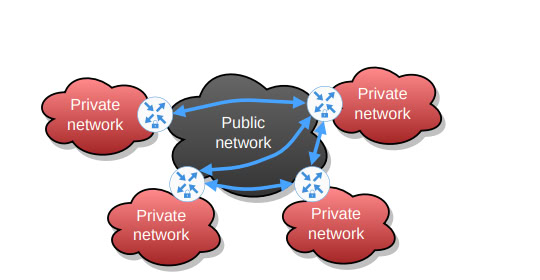
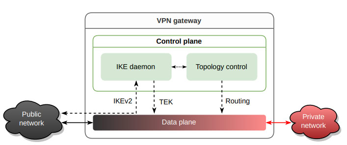

# Virtual Private Networks in the Quantum Era: A Security in Depth Approach

Conventional asymmetric cryptography is threatened by the ongoing development of quantum computers. A
mandatory countermeasure in the context of virtual private networks (VPNs) is to use post-quantum cryptography (PQC) as a drop-in replacement for the authenticated key exchange in the Internet Key Exchange (IKE)
protocol.

## Conclusion

The development of quantum computers threatens current VPN cryptographic methods. Post-quantum cryptography (PQC) is a mandatory countermeasure, but it is still under scrutiny. The article proposes combining PQC with quantum key distribution (QKD) and multipath key reinforcement (MKR) for enhanced security. The proposed solution includes a lightweight proxy for IKE packets, using all available symmetric keys to create a cryptographic tunnel. This ensures that even if PQC is compromised, the VPN remains secure.

## Key Points

- **Quantum Threat**: Quantum computers pose a significant threat to current asymmetric cryptography used in VPNs.

- **PQC Importance**: Post-quantum cryptography is essential to replace classical algorithms like RSA and ECDSA.

- **Orthogonal Methods**: Combining PQC with QKD and MKR offers a stronger defense against quantum attacks.

- **Lightweight Proxy**: A lightweight proxy can transparently tunnel IKE packets using combined symmetric keys.

- **Security in Depth**: The proxy approach ensures security in depth, protecting VPN traffic even if PQC is compromised.

- **Entity Authentication**: Secure identification of VPN gateways is crucial for quantum-resistant VPNs.

- **Confidentiality**: Client traffic confidentiality must be guaranteed end-to-end, even with intermediate gateways.

- **Data Integrity**: Protecting data integrity and preventing replay attacks are vital for secure VPN communication.

- **Key Synchronization**: A protocol for synchronizing symmetric keys between proxies is necessary for consistent security.

- **Persistent Key Storage**: Secure storage of symmetric keys and recovery methods are essential for maintaining VPN security.

## Summary

1. **Quantum Threat**: Quantum computers threaten current VPN cryptographic methods, necessitating new approaches to ensure security.
   
2. **Post-Quantum Cryptography (PQC)**: Implementing PQC is mandatory to replace vulnerable classical algorithms in VPNs.

3. **Combining Security Methods**: Using PQC along with QKD and MKR provides a robust defense against potential quantum attacks.

4. **Lightweight Proxy Concept**: A proposed lightweight proxy can tunnel IKE packets using all available symmetric keys, enhancing security.

5. **Security in Depth**: This proxy method offers layered security, making it difficult for attackers to compromise VPN traffic.

6. **Entity Authentication**: Ensuring the secure identification of VPN gateways is critical for maintaining quantum-resistant VPNs.

7. **End-to-End Confidentiality**: VPNs must guarantee the confidentiality of client traffic throughout the entire communication path.

8. **Integrity and Replay Protection**: Detecting unauthorized data modifications and preventing replay attacks are essential for secure VPN operations.

9. **Key Synchronization Protocol**: Synchronizing symmetric keys between VPN proxies is necessary to maintain security consistency.

10. **Persistent Key Storage**: Securely storing symmetric keys and having reliable recovery methods are crucial for VPN security.

## Introduction
The authors propose a lightweight proxy concept to transparently secure Internet Key Exchange (IKE) protocol packets with available symmetric keys, ensuring a layered security approach. The remaining sections of the article elaborate on VPN principles, the proposed design, and its evaluation.

---

### Summary

1. **Background on VPNs**: 
   VPNs create secure tunnels over untrusted public networks. The paper focuses on site-to-site VPN deployments using IPsec protocol, which includes IKE for entity authentication and key exchange, and ESP for traffic encryption and integrity.

2. **Objectives and Threat Model**: 
   The paper outlines the goals of a quantum-resistant VPN, emphasizing the need for entity authentication, confidentiality, data integrity, and replay protection. It assumes a strong Dolev-Yao attacker model with quantum computing capabilities.

3. **Related Work**: 
   Existing methods for securing VPNs using PQC and symmetric key management techniques like pre-shared keys (PSKs), QKD, and MKR are discussed. Each method has limitations, necessitating a combined approach.

4. **IKE Proxy Design**: 
   The authors present a lightweight proxy that intercepts IKE packets and secures them using combined symmetric keys from various sources. The design includes packet interception, a proxy header, dynamic address mapping, key synchronization, secure key storage, and TEK reinforcement.

5. **Discussion**: 
   The proposed proxy design enhances VPN security by providing layered protection and ensuring quantum resistance. The design's scalability, robustness, and minimal impact on performance are highlighted.

6. **Conclusion**: 
   The paper concludes that the IKE proxy approach strengthens VPN security without compromising existing functionalities. Future work includes formal analysis and exploring efficient key distribution methods.

---

### Key Points

- **VPN Security**: Modern VPNs rely on asymmetric cryptography, which is vulnerable to quantum attacks.
  
- **Post-Quantum Cryptography (PQC)**: PQC is essential for future-proofing VPNs against quantum threats but is currently less mature and efficient than classical cryptography.

- **Quantum Key Distribution (QKD)**: QKD provides secure key exchange by leveraging quantum mechanics, though it has practical limitations in network deployment.

- **Multipath Key Reinforcement (MKR)**: MKR enhances security by distributing key shares across multiple paths, complicating eavesdropping efforts.

- **IKE Proxy Design**: The proposed proxy transparently tunnels IKE packets, combining multiple symmetric key sources for enhanced security.

- **Dynamic Key Management**: The design includes dynamic address mapping and key synchronization to adapt to network changes.

- **Secure Key Storage**: Ensuring the persistence and security of keys during reboots and attacks is crucial.

- **Scalability**: The proxy design is scalable, supporting numerous VPN gateways without performance degradation.

- **Implementation Security**: The proxy's lightweight and focused design minimizes the increase in the trusted computing base and facilitates formal security analysis.

- **Future Work**: Further analysis and development of automatic key distribution methods are needed to streamline implementation and enhance security.

## Background: Virtual Private Networks

This section provides an overview of site-to-site VPN deployments and their underlying principles, focusing on the use of IPsec for secure communication over untrusted public networks.

#### Site-to-Site VPN Deployment

In a site-to-site VPN deployment, VPN gateways connect multiple trusted private networks through secure tunnels over an untrusted public network. Each site, such as a company office or public authority, has a VPN gateway that tunnels traffic securely from clients within the local private network to remote sites.

*Figure 1: Example for a site-to-site VPN deployment: VPN gateways connect multiple (trusted) private networks via an untrusted public network by establishing secure tunnels.*

#### IPsec Protocol Family

The VPN operates at the network layer using the IPsec protocol family, which includes the Internet Key Exchange version 2 (IKEv2) for entity authentication and key exchange. IKEv2 is responsible for establishing security associations (SAs), which are then used by the Encapsulating Security Payload (ESP) to ensure the confidentiality and integrity of data within these tunnels.

#### Security Associations (SAs)

Established SAs form an overlay topology that dynamically determines the optimal routing and scalability of the VPN. This overlay topology can handle complex scenarios such as nested or load-balanced VPN gateways. Packets must still be protected end-to-end, even when some gateways cannot directly reach each other due to external firewalls or nested scenarios.

#### Overlay Topology and Routing

To implement highly scalable and robust VPNs, the topology control algorithm dynamically determines the overlay topology. This algorithm manages routing within the overlay, ensuring end-to-end protection by implementing nested SAs where necessary. The architecture of a VPN gateway includes a control plane for topology control and a data plane for routing client packets, as depicted in Figure 2 of the document.

*Figure 2: Basic architecture of a VPN gateway: A topology control algorithm decides which SAs should be established and manages overlay routing. The IKE daemon is responsible for establishing SAs using an authenticated key exchange. The data plane uses the derived TEK to protect client packets using ESP and forwards them based on the routing decision. Dashed lines represent control flow, solid lines represent physical interfaces.*

#### Conclusion

The background section emphasizes the importance of a dynamic and secure overlay topology for the scalability and robustness of VPNs. It highlights the roles of IKEv2 for entity authentication and key exchange and ESP for ensuring data confidentiality and integrity. This foundation sets the stage for discussing the security enhancements needed to protect VPNs against quantum threats.

### Key Points

- **Site-to-Site VPN Deployment**: Connects multiple trusted private networks via secure tunnels over an untrusted public network.

- **IPsec Protocol Family**: Utilizes IKEv2 for entity authentication and key exchange, and ESP for data confidentiality and integrity.

- **Security Associations (SAs)**: Establishes an overlay topology that supports dynamic routing and scalability, protecting data end-to-end even in complex scenarios.

- **Overlay Topology Control**: A topology control algorithm dynamically determines the optimal routing and scalability of the VPN.

- **Nested SAs**: Ensures end-to-end protection by implementing nested SAs where necessary.

- **VPN Gateway Architecture**: Includes a control plane for topology control and a data plane for routing client packets.

- **Scalability and Robustness**: Emphasizes the importance of a dynamic and secure overlay topology for the scalability and robustness of VPNs.

## Objectives and Threat Model

This section defines the objectives for a quantum-resistant VPN and outlines the assumed threat model, considering the capabilities of quantum attackers.

#### Objectives

A quantum-resistant VPN has the following enhanced objectives compared to conventional VPNs:

1. **Entity Authentication**: Gateways must securely identify each other, and private IP address ranges must be securely linked to gateways.

2. **Confidentiality**: The confidentiality of client traffic must be guaranteed. This includes end-to-end cryptographic protection of traffic routed via intermediate gateways and ensuring forward secrecy, so the compromise of long-term keys does not affect the confidentiality of past security associations (SAs).

3. **Data Integrity and Replay Protection**: Unauthorized modification and replay of data packets must be detected and prevented.

4. **Cryptographic Agility**: The cryptographic mechanisms should be easily exchangeable to adapt to new developments in cryptanalysis.

5. **Non-Functional Properties**: Implementing quantum resistance should not degrade scalability, robustness to denial-of-service (DoS) attacks, graceful degradation in case of compromised devices, and implementation security.

#### Threat Model

The threat model assumes an exceptionally strong Dolev-Yao attacker with access to a sufficiently large quantum computer:

- **External Attacker Capabilities**: The attacker can break classical asymmetric cryptography on controlled links, store traffic now and decrypt it later after finding flaws in PQC algorithms, and potentially compromise a limited number of VPN gateways or other security-critical entities like QKD devices.

- **Assumptions about Attacker Limitations**: The attacker’s computational power and eavesdropping capabilities are limited, preventing them from breaking symmetric cryptographic primitives with adequate key sizes (≥ 256 bits) or eavesdropping on all links at all times.

The threat model acknowledges the possibility of an attacker storing traffic for future decryption attempts and considers the need to protect against such long-term threats by ensuring robust forward secrecy and cryptographic agility.

---

### Key Points

- **Entity Authentication**: Gateways must securely identify each other and link private IP addresses to gateways.
  
- **Confidentiality**: Ensures end-to-end protection of client traffic and maintains forward secrecy.

- **Data Integrity and Replay Protection**: Detects and prevents unauthorized modification and replay of data packets.

- **Cryptographic Agility**: Allows for easy exchange of cryptographic mechanisms to adapt to new threats.

- **Non-Functional Properties**: Maintains scalability, robustness to DoS attacks, graceful degradation, and implementation security while introducing quantum resistance.

- **Dolev-Yao Attacker Model**: Assumes a strong attacker with quantum computing capabilities, able to break classical cryptography and store traffic for future decryption.

- **Attacker Limitations**: The attacker's ability to break symmetric cryptographic primitives and eavesdrop on all links is limited by computational power and resources.

- **Protection Against Long-Term Threats**: Emphasizes the importance of forward secrecy and cryptographic agility to guard against future decryption attempts.

---
